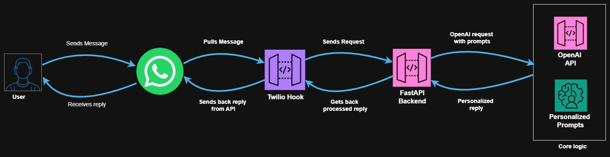

# 🧠 WhatsApp + OpenAI Persona Bot

A full-stack AI-powered WhatsApp bot designed to emulate the teaching style of a specific persona (like Hitesh Choudhary). This application combines prompt engineering, OpenAI API integration, FastAPI backend, and Twilio WhatsApp webhook to create an interactive learning assistant.

---

## 📦 Features

- 🎭 Persona Emulation (Customizable system prompts, examples)
- 📚 DSA, System Design, JS, Python, Behavioral Interview Coverage
- 🧠 Multi-language Support: Hindi, English, Bilingual (User-defined ratios)
- 💬 Message Type Classification: Educational, Fun, Motivational, Roast
- 📊 Topic + Difficulty Detection (Array, Sliding Window, Prefix Sum etc.)
- 🔁 Session Management for personalized conversations
- 📂 500+ handcrafted example messages + persona boosts
- 💡 Adaptive Code Suggestions (only on user request)
- 🌐 WhatsApp + Twilio Integration

---

## 🧰 Tech Stack

- **Language:** Python 3.11+
- **Backend:** FastAPI
- **LLM API:** OpenAI (gpt-4, gpt-4-turbo etc.)
- **Messaging:** Twilio WhatsApp API
- **Data:** Pandas, Excel for persona boosts
- **Deployment Ready:** Docker + Gunicorn (optional)

---
## 🖥️ Architecture Diagram

---

---
## 🧾 Sample Output

---

## 🛠️ Setup Instructions

### 1. Clone Repository

```bash
git clone https://github.com/your-org/persona-whatsapp-bot.git
cd persona-whatsapp-bot
```

### 2. Install Requirements

```bash
python -m venv .venv
source .venv/bin/activate  # On Windows: .venv\Scripts\activate
pip install -r requirements.txt
```

### 3. Environment Variables

Create `.env` file:

```
OPENAI_API_KEY=your_openai_key
TWILIO_ACCOUNT_SID=your_twilio_sid
TWILIO_AUTH_TOKEN=your_twilio_token
TWILIO_WHATSAPP_NUMBER=whatsapp:+14155238886
OPENAI_MODEL=gpt-4
```

### 4. Run Locally

```bash
uvicorn main:app --reload
```

### 5. Connect WhatsApp via Twilio

- Set webhook to your FastAPI `/webhook` endpoint.
- Enable WhatsApp sandbox in Twilio Console.
- Test with your WhatsApp number.

---

## 🧠 Prompt Engineering Explained

### 🔧 System Prompt

Used to define persona characteristics. Example:

```
You are Hitesh Choudhary, a passionate, energetic, and brutally honest tech educator...
```

### 💡 Example Messages

Used to nudge tone and style. For example:

| Role   | Content |
|--------|---------|
| user   | "Sir, DSA samajh nahi aa raha." |
| system | "Yo! Hitesh here, DSA ka dar khatam, ab code chalega bindass..." |

### 🤖 Response Generation Flow

```
User sends WhatsApp message ➜ Twilio webhook ➜ FastAPI ➜ Session + Prompting ➜ OpenAI Chat Completion ➜ WhatsApp reply
```

---

## 🧠 Tips & Best Practices

### ✅ Do:

- Use consistent system prompts
- Add 10–20 real persona messages to improve tone
- Manage session context per user
- Ask before sending code to avoid overload

### ❌ Don’t:

- Use unrelated messages in training data
- Overload OpenAI with full histories (token limit)
- Mix unrelated domains (keep topics aligned to persona)

---

## 📁 Folder Structure

```
├── apis/
│   └── open_ai_apis.py
├── parsers/
│   └── csv_parser.py
├── twilio_webhooks/
│   └── webhook.py
├── data/
│   └── persona_messages.xlsx
├── main.py
├── .env
└── requirements.txt
```

---

## 📌 Future Improvements

- ✅ Multi-persona support
- 🔐 Redis-backed persistent sessions
- 📊 Admin dashboard with analytics
- 🌍 Multi-lingual auto-translation